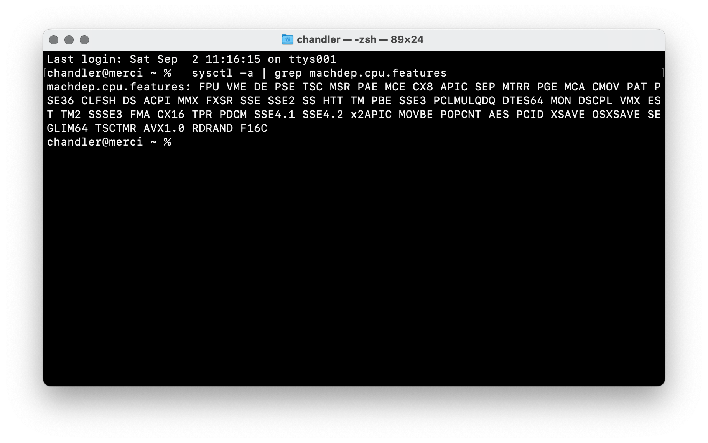
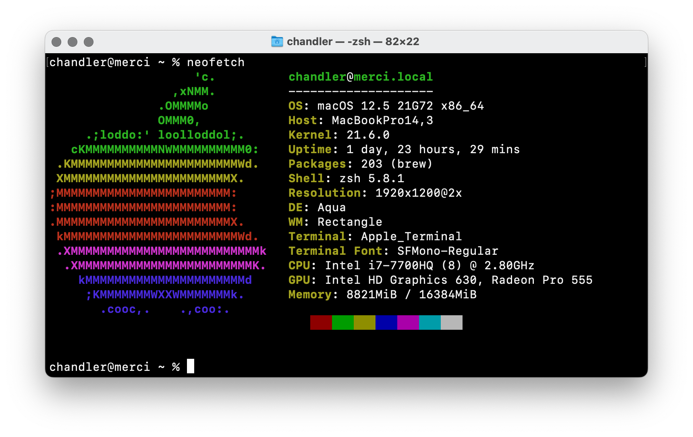

# MATH4610: Assignment 1

*Chandler Justice: A02313187*

## Deploying Virtual Machines

**Question 1** *Suppose you are running a Windows machine, but you have a program that needs to run in a Linux environment. How can you run the program while still technically using your Windows machine?*

In order to maintain the Windows environment, a person must run Windows as the host operating system, and then run Linux in a hypervisor (virtual machine) environment. This will allow the Linux application to run without terminating the Windows environment.

**Question 2** *What is the difference between a native and a hosted virtual machine monitor (hypervisor)?*

The native hypervisor, or type 1 hypervisor is an operating system intended only to be used as a platform for virtual machines to run on top of. With a type 1 hypervisor, there is no intermediary operating system like Windows or MacOS and this brings the virtual machine closer to the physical hardware verses a virtual machine monitor.

A type 2 hypervisor, also known as a hosted hypervisor, runs within a host operating system like MacOS, Windows, Linux, BSD, etc. This allows a user to install a virtual machine on their computer alongside the host operating system, with some hypervisors like parallels and VirtualBox allowing for seamless integration between the host OS and virtual OS. This is the type of hypervisor we are using in the class (virtualBox).

**Question 3** *What is the difference between a virtual machine and a virtual appliance?*

A virtual machine is a compisition of virtual hardware hosted by a hypervisor including CPU, GPU, Ram, I/O, etc and an operating system running within that virtual hardware. A virtual machine is a complete computer running in a virtual environment.

A virtual appliance is a mininal operating system image packaged alongside some software to allow for specific functionality within the virtual machine. The distinction between a VM and VA is that a VM is a generic virtual envrionment that emulates the entire functionality of a computer, wheras a VA will only contain packages and software critical to the intended functionality of the VA. Generally, a VA is configured to do one job while a VM could be used to complete any general computing tasks.

**Question 4** *What are the associated benefits of using virtualization software? Give a few examples of each benefit..*

*   Legacy support: If a person needs to run software intended for an operating system no longer supported by modern hardware, the person can install a hypervisor running the older operating system on their modern hardware and then install the legacy software within that VM.

*   Compatibility testing: A user could use their Linux host with Windows and MacOS running in hypervisors to test the compatibility of their software across all three platforms on the same machine. This could allow a user with limited budget to validate their software on all these platforms without having to buy dedicated hardware for each platform.

*   Parallel workflow: If a user wants to compile a binary in the background while only using a strict amount of resources, they could compile the binary in a VM with limited virtual hardware to free up their remaining resources for other tasks.

*   Sandboxing: If a user wants to experiment with software that might not be stable, or test OS configurations, this can be done in a virtual environment where the virtual OS can be modified and manipulated without affecting the host OS. In the event something does go wrong, the user can simply delete the VM from their system or restore a working VM image from a previous state.

**Question 5** *What is the difference between native and hosted virtual machine monitors?*

*See **Deploying Virtual Machines: Question 2***

**Question 6** *What are the three components of virtual machines?*

1. Hypervisor - provides and manages virtual resources for virtual machines. Additionally, will manage the VM image and in some cases dynamically scale the size of the VM image to accomodate the needs of the VM

2. Host OS - Provides access to the direct hardware and acts as an intermediary link between the physical hardware and the hypervisor. In a type 1 hypervisor, this will be an OS dedicated to facilitating virtual machines, and in a type 2 hypervisor this will be a more conventional OS like Windows or MacOS.

3. Physical Hardware - this the computer running the Host OS and the hypervisor. This hardware can vary from a personal computer to a datacenter server.
    
## Hardware Virtualization

**Question 1** *Verify that the computer you are using for the class is able to handle hardware virtualization. Along with the apps/commands needed to determine whether or not hardware virtualization is enabled, include a screenshot that shows the computer is hardware virtualization enabled. Use something like Snip&Sketch or the equivalent Apple screen shot app.*

As shown in the screenshot below, my MacBook has VMX enabled:

**Question 2** *Read the article at the link:*

[Cloud Computing](https://aws.amazon.com/what-is/virtualization)

*and write a few sentences about the downside of running virtual computers on your laptop or desktop. Do not use ChatGPT or other AI application. After writing your answer to this question, run a request into ChatGPT to see what the bot finds. Compare your answer to the response from ChatGPT.*

My response: 

In the article, it is mentioned that virtualization is great for businesses because it allows for 100% of a server's performance to be utilized simultainiously. While this is optimal for enterprise applications where the server serves a specific purpose, using 100% of a personal desktop or laptop's resources will result in significantly degraded user experience and may result in unintended behaviors from the computer. Consumer devices manage resources differently than enterprise servers, and it is important to have overhead in bandwidth for consumer devices to be able to accomodate for sudden changes in computing demand. For example, if a user is running a VM and then wants to open their web browser in their Host OS, if there are not sufficient resources to perform both tasks the computer will have to start compensating for this by loading memory into a SWAP partition and giving applications less run time on the CPU. To the user this will manifest in the form of degraded performance and in severe cases system crashes or application crashes.

ChatGPT: 
*   **Prompt**: Please list some of the disadvantages of running a virtual machine on a personal desktop or laptop.

*   **Response**: Running a virtual machine (VM) on a personal desktop or laptop can be a useful way to isolate and manage different operating systems and software, but it also comes with several disadvantages, including:

    1. **Performance Overhead:** VMs consume system resources like CPU, RAM, and disk space. Running multiple VMs simultaneously can lead to a significant performance overhead, slowing down your host machine.

    2. **Resource Intensive:** Running resource-intensive applications within VMs can be challenging, as they may compete for limited system resources with the host OS and other VMs.

    3. **Limited Hardware Access:** VMs may not have direct access to hardware components, limiting their ability to utilize specialized hardware such as graphics cards, USB devices, or other peripherals.

    4. **Compatibility Issues:** Some software or hardware may not work properly within a VM due to compatibility issues or lack of driver support.

    5. **Security Concerns:** VMs can be vulnerable to security risks, and a compromised VM can potentially affect the security of the host system. Additionally, vulnerabilities in the VM software can be exploited to compromise the host system.

    6. **Complexity:** Managing VMs can be complex, especially when dealing with multiple VMs, networking configurations, and resource allocation. It requires some expertise to set up and maintain VMs effectively.

    7. **Resource Allocation Challenges:** Allocating resources like CPU cores and RAM to VMs can be tricky. Overallocating or underallocating resources can impact VM performance and the host system.

    8. **Software Licensing:** Depending on the software and operating systems you run within VMs, you may encounter licensing issues. Some software licenses may not permit their use within VMs without additional licenses.

    9. **Disk Space Usage:** VMs can quickly consume a significant amount of disk space, especially if you create snapshots or save the VM state regularly.

    10. **Backup and Recovery:** Backup and recovery processes for VMs can be more complex than those for the host OS. Managing backups for multiple VMs adds an additional layer of complexity.

    11. **Limited Graphics Performance:** VMs may not provide the same level of graphics performance as running an OS directly on hardware, which can be a drawback for tasks like gaming or graphics-intensive applications.

    12. **Lack of Direct Hardware Control:** VMs abstract hardware, which means you have limited control over hardware settings and configurations compared to running an OS directly on bare metal.

    13. **Network Configuration Challenges:** Setting up networking configurations for VMs, especially for advanced use cases like virtual LANs or complex network topologies, can be challenging.

    14. **Software Updates:** Managing software updates within VMs can be more complex, as you need to update both the host OS and each VM separately.

    15. **Snapshot Management:** While snapshots can be useful for preserving VM states, managing them can become unwieldy if you create many snapshots over time.

    Despite these disadvantages, running VMs on a personal desktop or laptop can still be beneficial in many scenarios, such as development and testing, running multiple OS environments, or for educational purposes. However, it's essential to be aware of these drawbacks and plan your VM usage accordingly.

**Question 3** *Provide a screen shot of the resources available on your physical computer. How many cores, speed, and so on. You can find the information in the About tab in the Updates and Security section on the computer. Use a screen shot of the popup window.*

Below is a screenshot of my computer's available resources. I used `neofetch` to obtain the system information:

**Question 4** *What are the benefits of virtualization, and what is one situation where you would want to use a VM instead of a physical machine?*

*See **Deploying Virtual Machines: Question 4*** for benefits of virtualization.

A situation I have often used virtualization is evaluating Linux distributions and configurations. If I am thinking of using a new Linux distribution, I can deploy that virtual machine in a type 2 hypervisor overtop my host operating system. This removes the permenant effects of formating a hard drive and installing the OS on bare metal, and also allows for an easier installation since the host machine does not have to be reconfigured. 

Additionally, virtualization can be used for evaluation and testing of malicious code. If the virtual machine is configured correctly, an infected guest OS can be experimented on without risk of facing the ramifacications of the malicious code on the host computer.

**Question 5** *What is the difference between a native system virtual machine and a hosted system virtual machine?*

*See **Deploying Virtual Machines: Question 2***

**Question 6** *What are 2 operational benefits of virtualization?*

1. Efficient hardware utilization: If a user wants to run multiple services on a single server, they can utilize virtualization to host all of these services on the same machine. An example of this would be running a website host in one virtual environment, and then an email server in another virtual environment. The email server could be given access to additional storage devices not accessible to the web server creating more security around the email storage since the web server cannot access those hardware resources.

2. Quick recovery: A landmark feature of virtualization is the ability to package the entire OS and configuration into a VM image. This means if a user changes their host computer they can quickly re-instantiate their virtual OS by loading the VM image into a hypervisor. The VM will function identically to how it did under the previous configuration. 
    - This also allows for ease in scalability. If a business needs to deploy more servers as their demands scale, they can simply host the VM image on more computers, or even multiple instances of the VM image on the same host.